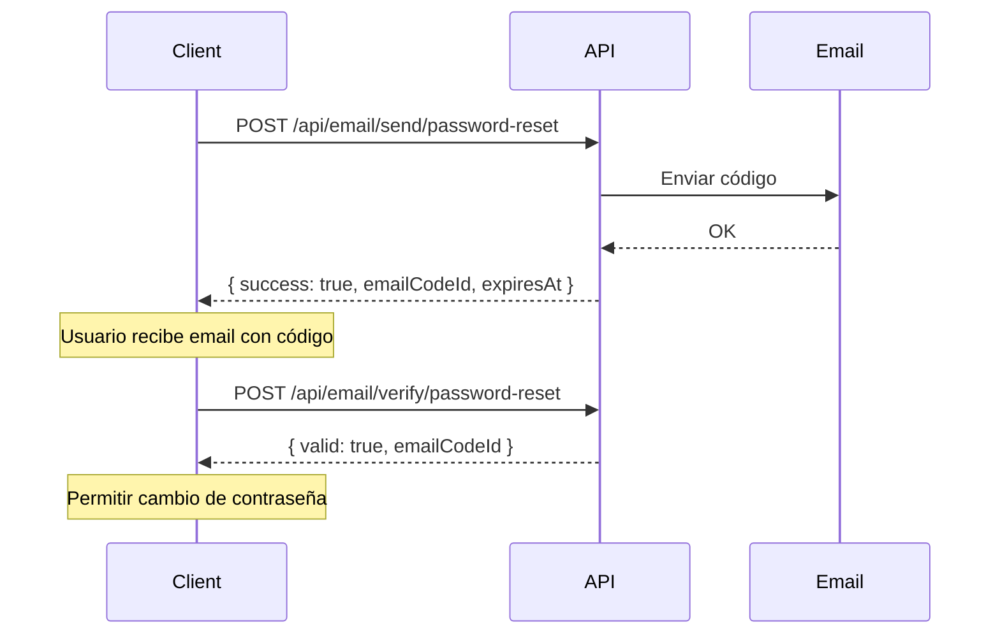
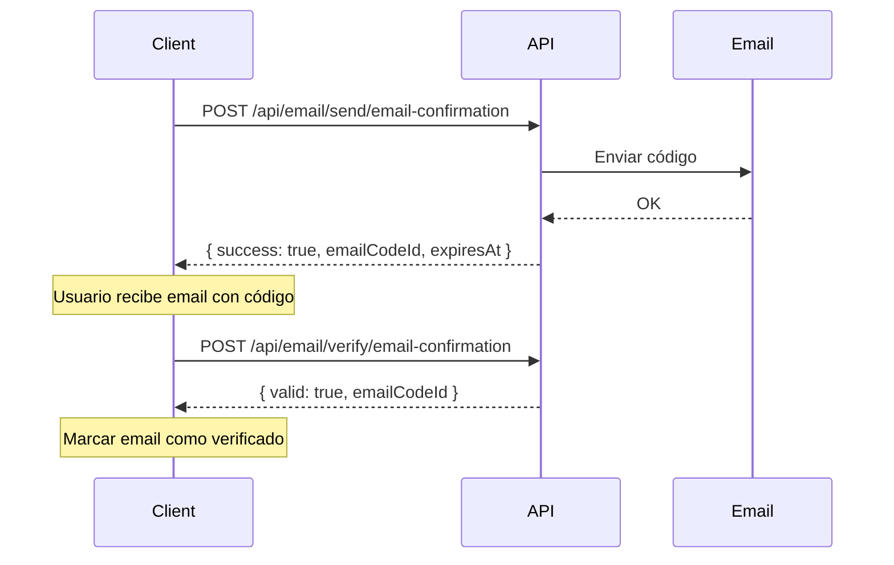

# API de Envío de Correos Electrónicos

Esta documentación describe los endpoints disponibles para el servicio de envío de correos electrónicos de ClubCheck.

## Índice

1. [Configuración](#configuración)
2. [Tipos de Correo](#tipos-de-correo)
3. [Endpoints de Estado](#endpoints-de-estado)
4. [Endpoints de Envío](#endpoints-de-envío)
5. [Endpoints de Verificación](#endpoints-de-verificación)
6. [Endpoints de Historial](#endpoints-de-historial)
7. [Códigos de Error](#códigos-de-error)

---

## Configuración

### Variables de Entorno Requeridas

Configura las siguientes variables en tu archivo `.env`:

```env
# Email configuration
MAIL_HOST = "smtp.gmail.com"
MAIL_PORT = 587
MAIL_ENABLE_SSL = true
MAIL_FROM_ADDRESS = "tu-email@gmail.com"
MAIL_FROM_NAME = "ClubCheck"
MAIL_USER = "tu-email@gmail.com"
MAIL_PASSWORD = "tu-app-password"
```

> **Nota para Gmail**: Usa una [contraseña de aplicación](https://support.google.com/accounts/answer/185833) en lugar de tu contraseña regular.

### Instalación de Dependencias

```bash
composer install
```

### Migración de Base de Datos

Ejecuta el script de migración para crear las tablas necesarias:

```sql
-- Archivo: database/migrations/create_email_tables.sql
```

---

## Tipos de Correo

| Código | Nombre | Requiere Código | Expiración | Max Intentos |
|--------|--------|-----------------|------------|--------------|
| `PASSWORD_RESET` | Restablecer Contraseña | ✅ Sí | 15 min | 3 |
| `EMAIL_CONFIRMATION` | Confirmación de Correo | ✅ Sí | 60 min | 5 |
| `NORMAL` | Correo Normal | ❌ No | - | - |
| `WELCOME` | Bienvenida | ❌ No | - | - |
| `NOTIFICATION` | Notificación | ❌ No | - | - |

---

## Endpoints de Estado

### GET /api/email/status

Verifica el estado de configuración del servicio de email.

**Respuesta:**
```json
{
    "configured": true,
    "timestamp": 1710588000
}
```

---

### GET /api/email/types

Obtiene los tipos de email disponibles.

**Respuesta:**
```json
{
    "types": [
        {
            "id": 1,
            "code": "PASSWORD_RESET",
            "name": "Restablecer Contraseña",
            "description": "Código para restablecer la contraseña del usuario",
            "requiresCode": true,
            "codeExpirationMinutes": 15,
            "maxAttempts": 3
        },
        {
            "id": 2,
            "code": "EMAIL_CONFIRMATION",
            "name": "Confirmación de Correo",
            "description": "Código para confirmar dirección de correo electrónico",
            "requiresCode": true,
            "codeExpirationMinutes": 60,
            "maxAttempts": 5
        }
    ]
}
```

---

## Endpoints de Envío

### POST /api/email/send

Envía un correo electrónico normal (sin código de verificación).

**Request Body:**
```json
{
    "email": "destinatario@ejemplo.com",
    "subject": "Asunto del correo",
    "body": "<h1>Contenido HTML</h1><p>Este es el cuerpo del mensaje.</p>",
    "toName": "Nombre Destinatario",
    "customerApiId": "CLUB-001",
    "metadata": {
        "key": "value"
    }
}
```

| Campo | Tipo | Requerido | Descripción |
|-------|------|-----------|-------------|
| `email` | string | ✅ | Dirección de correo del destinatario |
| `subject` | string | ✅ | Asunto del correo |
| `body` | string | ✅ | Cuerpo del correo (HTML permitido) |
| `toName` | string | ❌ | Nombre del destinatario |
| `customerApiId` | string | ❌ | ID del customer relacionado |
| `adminId` | string | ❌ | ID del administrador relacionado |
| `userId` | int | ❌ | ID del usuario relacionado |
| `metadata` | object | ❌ | Datos adicionales |

**Respuesta exitosa (200):**
```json
{
    "success": true,
    "message": "Correo enviado exitosamente",
    "emailCodeId": "550e8400-e29b-41d4-a716-446655440000"
}
```

**Respuesta error (422/500):**
```json
{
    "success": false,
    "error": "El campo email es requerido"
}
```

---

### POST /api/email/send/password-reset

Envía un correo de restablecimiento de contraseña con código de verificación.

**Request Body:**
```json
{
    "email": "usuario@ejemplo.com",
    "toName": "Juan Pérez",
    "userName": "Juan",
    "customerApiId": "CLUB-001",
    "userId": 123,
    "metadata": {
        "requestedFrom": "mobile-app"
    }
}
```

| Campo | Tipo | Requerido | Descripción |
|-------|------|-----------|-------------|
| `email` | string | ✅ | Dirección de correo del usuario |
| `toName` | string | ❌ | Nombre del destinatario |
| `userName` | string | ❌ | Nombre del usuario (para personalizar mensaje) |
| `customerApiId` | string | ❌ | ID del customer |
| `adminId` | string | ❌ | ID del administrador |
| `userId` | int | ❌ | ID del usuario |
| `metadata` | object | ❌ | Datos adicionales |

**Respuesta exitosa (200):**
```json
{
    "success": true,
    "message": "Código de restablecimiento enviado",
    "emailCodeId": "550e8400-e29b-41d4-a716-446655440000",
    "expiresAt": "2026-03-16 14:30:00",
    "expirationMinutes": 15,
    "code": "123456"  // Solo en modo development
}
```

**Respuesta error - Rate Limiting (429):**
```json
{
    "success": false,
    "error": "Has solicitado demasiados códigos. Espera 15 minutos."
}
```

> **Nota**: El campo `code` solo se incluye cuando `APP_MODE=development` para facilitar pruebas.

---

### POST /api/email/send/email-confirmation

Envía un correo de confirmación de dirección de email.

**Request Body:**
```json
{
    "email": "nuevo@ejemplo.com",
    "toName": "María García",
    "userName": "María",
    "customerApiId": "CLUB-001"
}
```

| Campo | Tipo | Requerido | Descripción |
|-------|------|-----------|-------------|
| `email` | string | ✅ | Dirección de correo a confirmar |
| `toName` | string | ❌ | Nombre del destinatario |
| `userName` | string | ❌ | Nombre del usuario |
| `customerApiId` | string | ❌ | ID del customer |
| `adminId` | string | ❌ | ID del administrador |
| `userId` | int | ❌ | ID del usuario |
| `metadata` | object | ❌ | Datos adicionales |

**Respuesta exitosa (200):**
```json
{
    "success": true,
    "message": "Código de confirmación enviado",
    "emailCodeId": "550e8400-e29b-41d4-a716-446655440000",
    "expiresAt": "2026-03-16 15:15:00",
    "expirationMinutes": 60,
    "code": "654321"  // Solo en modo development
}
```

---

### POST /api/email/send/welcome

Envía un correo de bienvenida al registrar un nuevo usuario.

**Request Body:**
```json
{
    "email": "nuevo-usuario@ejemplo.com",
    "toName": "Carlos López",
    "userName": "Carlos",
    "companyName": "Mi Gimnasio",
    "customerApiId": "CLUB-001"
}
```

| Campo | Tipo | Requerido | Descripción |
|-------|------|-----------|-------------|
| `email` | string | ✅ | Dirección de correo del destinatario |
| `toName` | string | ❌ | Nombre del destinatario |
| `userName` | string | ❌ | Nombre del usuario |
| `companyName` | string | ❌ | Nombre de la empresa/gimnasio |
| `customerApiId` | string | ❌ | ID del customer |
| `metadata` | object | ❌ | Datos adicionales |

**Respuesta exitosa (200):**
```json
{
    "success": true,
    "message": "Correo enviado exitosamente",
    "emailCodeId": "550e8400-e29b-41d4-a716-446655440000"
}
```

---

### POST /api/email/send/notification

Envía una notificación por correo electrónico.

**Request Body:**
```json
{
    "email": "usuario@ejemplo.com",
    "subject": "Tu membresía está por vencer",
    "body": "<h1>Recordatorio</h1><p>Tu membresía vence en 3 días.</p>",
    "toName": "Ana Martínez",
    "customerApiId": "CLUB-001"
}
```

| Campo | Tipo | Requerido | Descripción |
|-------|------|-----------|-------------|
| `email` | string | ✅ | Dirección de correo del destinatario |
| `subject` | string | ✅ | Asunto del correo |
| `body` | string | ✅ | Cuerpo del correo (HTML permitido) |
| `toName` | string | ❌ | Nombre del destinatario |
| `customerApiId` | string | ❌ | ID del customer |
| `metadata` | object | ❌ | Datos adicionales |

**Respuesta exitosa (200):**
```json
{
    "success": true,
    "message": "Correo enviado exitosamente",
    "emailCodeId": "550e8400-e29b-41d4-a716-446655440000"
}
```

---

## Endpoints de Verificación

### POST /api/email/verify

Verifica un código de verificación genérico.

**Request Body:**
```json
{
    "email": "usuario@ejemplo.com",
    "code": "123456",
    "type": "PASSWORD_RESET"
}
```

| Campo | Tipo | Requerido | Descripción |
|-------|------|-----------|-------------|
| `email` | string | ✅ | Dirección de correo |
| `code` | string | ✅ | Código de verificación (6 dígitos) |
| `type` | string | ✅ | Tipo de código: `PASSWORD_RESET`, `EMAIL_CONFIRMATION` |

**Respuesta exitosa - Código válido (200):**
```json
{
    "valid": true,
    "message": "Código verificado correctamente",
    "emailCodeId": "550e8400-e29b-41d4-a716-446655440000",
    "data": {
        "email": "usuario@ejemplo.com",
        "type": "PASSWORD_RESET",
        "customerApiId": "CLUB-001",
        "adminId": null,
        "userId": 123
    }
}
```

**Respuesta error - Código inválido (400):**
```json
{
    "valid": false,
    "message": "Código incorrecto. Te quedan 2 intentos.",
    "attemptsRemaining": 2
}
```

---

### POST /api/email/verify/password-reset

Endpoint específico para verificar códigos de restablecimiento de contraseña.

**Request Body:**
```json
{
    "email": "usuario@ejemplo.com",
    "code": "123456"
}
```

| Campo | Tipo | Requerido | Descripción |
|-------|------|-----------|-------------|
| `email` | string | ✅ | Dirección de correo |
| `code` | string | ✅ | Código de verificación |

**Respuesta exitosa (200):**
```json
{
    "valid": true,
    "message": "Código verificado correctamente",
    "emailCodeId": "550e8400-e29b-41d4-a716-446655440000",
    "data": {
        "email": "usuario@ejemplo.com",
        "type": "PASSWORD_RESET",
        "customerApiId": "CLUB-001",
        "adminId": null,
        "userId": 123
    }
}
```

---

### POST /api/email/verify/email-confirmation

Endpoint específico para verificar códigos de confirmación de email.

**Request Body:**
```json
{
    "email": "nuevo@ejemplo.com",
    "code": "654321"
}
```

| Campo | Tipo | Requerido | Descripción |
|-------|------|-----------|-------------|
| `email` | string | ✅ | Dirección de correo |
| `code` | string | ✅ | Código de verificación |

**Respuesta exitosa (200):**
```json
{
    "valid": true,
    "message": "Código verificado correctamente",
    "emailCodeId": "550e8400-e29b-41d4-a716-446655440000",
    "data": {
        "email": "nuevo@ejemplo.com",
        "type": "EMAIL_CONFIRMATION",
        "customerApiId": "CLUB-001",
        "adminId": null,
        "userId": null
    }
}
```

---

## Endpoints de Historial

### GET /api/email/history/:email

Obtiene el historial de correos enviados a un email específico.

**URL Parameters:**
- `email`: Dirección de correo (URL encoded)

**Query Parameters:**
- `limit`: Número máximo de registros (default: 50, max: 100)

**Ejemplo:**
```
GET /api/email/history/usuario%40ejemplo.com?limit=20
```

**Respuesta:**
```json
{
    "email": "usuario@ejemplo.com",
    "count": 3,
    "history": [
        {
            "id": "550e8400-e29b-41d4-a716-446655440000",
            "type": "PASSWORD_RESET",
            "typeName": "Restablecer Contraseña",
            "subject": "Restablecer tu contraseña - ClubCheck",
            "sentAt": "2026-03-16 14:15:00",
            "expiresAt": "2026-03-16 14:30:00",
            "isUsed": true,
            "usedAt": "2026-03-16 14:20:00",
            "attempts": 1
        },
        {
            "id": "660e8400-e29b-41d4-a716-446655440001",
            "type": "WELCOME",
            "typeName": "Bienvenida",
            "subject": "¡Bienvenido a ClubCheck!",
            "sentAt": "2026-03-15 10:00:00",
            "expiresAt": null,
            "isUsed": false,
            "usedAt": null,
            "attempts": 0
        }
    ]
}
```

---

### GET /api/email/stats

Obtiene estadísticas de envíos de correo por tipo.

**Respuesta:**
```json
{
    "stats": [
        {
            "id": 1,
            "code": "PASSWORD_RESET",
            "name": "Restablecer Contraseña",
            "totalSent": 150,
            "totalUsed": 120,
            "totalPending": 5
        },
        {
            "id": 2,
            "code": "EMAIL_CONFIRMATION",
            "name": "Confirmación de Correo",
            "totalSent": 300,
            "totalUsed": 280,
            "totalPending": 10
        },
        {
            "id": 3,
            "code": "NORMAL",
            "name": "Correo Normal",
            "totalSent": 500,
            "totalUsed": 0,
            "totalPending": 0
        }
    ],
    "timestamp": 1710588000
}
```

---

### POST /api/email/cleanup

Limpia los códigos expirados (marcarlos como usados). Útil para tareas programadas (cron).

**Request Body:** (vacío)

**Respuesta:**
```json
{
    "success": true,
    "cleaned": 25,
    "timestamp": 1710588000
}
```

---

## Códigos de Error

| Código HTTP | Descripción |
|-------------|-------------|
| 200 | Operación exitosa |
| 400 | Código inválido o datos incorrectos |
| 405 | Método no permitido |
| 422 | Error de validación (campos requeridos faltantes) |
| 429 | Rate limiting - demasiadas solicitudes |
| 500 | Error interno del servidor |

---

## Flujos Comunes

### Flujo de Restablecimiento de Contraseña



### Flujo de Confirmación de Email



---

## Ejemplos en Código

### C# / .NET

```csharp
// Enviar código de restablecimiento
var response = await httpClient.PostAsJsonAsync("/api/email/send/password-reset", new
{
    email = "usuario@ejemplo.com",
    userName = "Juan"
});

var result = await response.Content.ReadFromJsonAsync<PasswordResetResponse>();

// Verificar código
var verifyResponse = await httpClient.PostAsJsonAsync("/api/email/verify/password-reset", new
{
    email = "usuario@ejemplo.com",
    code = "123456"
});

var verifyResult = await verifyResponse.Content.ReadFromJsonAsync<VerifyResponse>();

if (verifyResult.Valid)
{
    // Permitir cambio de contraseña
}
```

### JavaScript / TypeScript

```typescript
// Enviar código de restablecimiento
const response = await fetch('/api/email/send/password-reset', {
    method: 'POST',
    headers: { 'Content-Type': 'application/json' },
    body: JSON.stringify({
        email: 'usuario@ejemplo.com',
        userName: 'Juan'
    })
});

const result = await response.json();

// Verificar código
const verifyResponse = await fetch('/api/email/verify/password-reset', {
    method: 'POST',
    headers: { 'Content-Type': 'application/json' },
    body: JSON.stringify({
        email: 'usuario@ejemplo.com',
        code: '123456'
    })
});

const verifyResult = await verifyResponse.json();

if (verifyResult.valid) {
    // Permitir cambio de contraseña
}
```

---

## Rate Limiting

Para evitar abuso, el sistema implementa rate limiting:

| Tipo | Límite | Intervalo |
|------|--------|-----------|
| PASSWORD_RESET | 3 solicitudes | 15 minutos |
| EMAIL_CONFIRMATION | 5 solicitudes | 60 minutos |

Si se excede el límite, recibirás un error 429 con el mensaje correspondiente.

---

## Consideraciones de Seguridad

1. **Códigos de un solo uso**: Una vez verificado, un código no puede ser usado nuevamente.
2. **Expiración**: Los códigos tienen tiempo de vida limitado.
3. **Intentos limitados**: Después de X intentos fallidos, el código se invalida.
4. **Códigos ocultos en producción**: El código solo se devuelve en modo `development`.
5. **Invalidación automática**: Al solicitar un nuevo código, los anteriores se invalidan.
